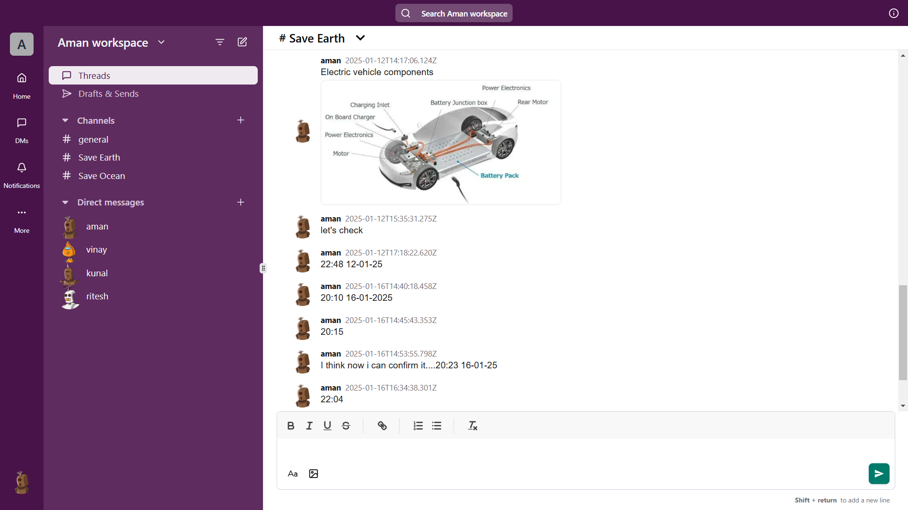

# Slack Messaging App Frontend

## Description

Full stack messaging web app, where users can send messages via channels or DM. Used socket.io for bidirectional communication with low latency. Used Zod validator and JWT tokens for secure user authentication and authorization. Employed Quill text editor. Architected scalable backend system utilizing Express.js for handling http requests. Leveraged MongoDB for efficient data storage, and used Mongoose as an ODM for easy and efficient data handling. Integrated Razorpay for payment gateway and AWS S3 bucket for media uploads with improving storage efficiency.

## App pic



## Tech Stack

### **Frontend:**

- React.js
- Tailwind CSS

### **Backend:**

- Node.js
- MongoDB
- Express.js

### **Integrations**

- Socket.io
- Razorpay
- AWS s3

## Setup Instructions

### For frontend

```bash
git clone https://github.com/Vinay14Newbie/Slack-Messaging-App-Frontend.git
cd Slack-Messaging-App-Frontend
```

#### Install Dependencies

```bash
    npm install
```

#### Create .env File

```bash
VITE_BACKEND_API_URL=your_backend_url
VITE_BACKEND_SOCKET_URL=your_backend_socket_url
VITE_RAZORPAY_KEY_I=your_razorpay_key_id
```

#### Start the frontend server

```bash
    npm run dev
```

### For Backend

Follow this: https://github.com/Vinay14Newbie/Slack-Messaging-App-Backend
